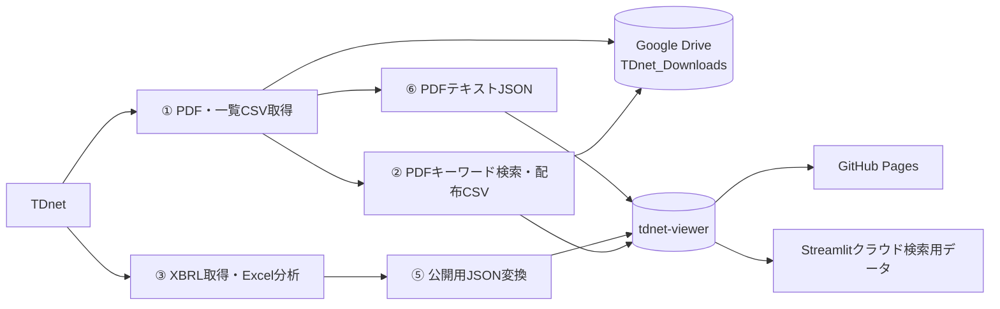

# tdnet_get

TDnetから適時開示資料（PDF・XBRL）を取得し、キーワード検索用データと財務分析データを生成・公開するシステムです。

現在の日次処理はGitHub Actions上で動作するため、PCの電源が切れていても実行されます。取得したPDF・CSVは個人のGoogle Driveへ保存し、XBRL分析結果は別リポジトリのGitHub Pagesで公開します。

## 公開先・管理画面

- XBRL Financial Viewer: https://onokazu777.github.io/tdnet-viewer/
- 更新処理（GitHub Actions）: https://github.com/onokazu777/tdnet_get/actions
- 公開データのリポジトリ: https://github.com/onokazu777/tdnet-viewer
- PDFキーワード検索（Streamlit）: 公開URLはこのリポジトリ内に未記録
- ローカルキーワード検索: http://localhost:8501

## 処理の概要



平日に次の枠で取得します（JST）。

| 回 | 枠の開始 | 目的 | 完了メール |
|---|---|---|---|
| 1回目 | 11:35 | 午前の開示を取り込む | 送る |
| 2回目 | 15:35 | 15:30前後の大量開示を取り込む | 送る |
| 3回目 | 17:05 | 午後の追加開示を取り込む | 送らない |
| 4回目 | 20:05 | 夕方の追加開示を取り込む | 送らない |
| 5回目 | 23:55 | 当日分の取りこぼしを取り込む | 送らない |

**本番の起動は外部cron（時刻どおり）** です。GitHub の `schedule` は遅延するため予備扱いです。  
設定手順: [docs/on-time-trigger.md](docs/on-time-trigger.md)


## 主な構成

- `.github/workflows/daily_update.yml`  
  PC不要の日次処理。PDF・CSVのGoogle Drive保存と`tdnet-viewer`の更新まで行います。
- `.github/workflows/keepalive.yml`  
  GitHubの「公開リポジトリが60日間無活動だとscheduleを停止する」仕様を回避するため、月1回空コミットを作成します。
- `①_...py` ～ `⑥_...py`  
  取得、検索、XBRL分析、表示、JSON変換、PDFテキスト抽出を担当します。
- `keyword_search_app.py`  
  ローカルPDF・ローカルJSON・GitHub Pages上のJSONを検索するStreamlitアプリです。
- `run_auto_local.py` / `auto_local.bat`  
  PC上でPDF・CSVをGoogle Driveへ保存する旧ローカル経路です。GitHub Pagesの更新は行いません。

## 詳細ドキュメント

- [システム構成](docs/system-architecture.md)
- [データフローとファイル一覧](docs/data-flow.md)
- [プログラム一覧](docs/programs.md)
- [運用・障害対応](docs/operations.md)
- [時刻どおり起動（外部cron）](docs/on-time-trigger.md)

## ローカル環境

```powershell
pip install -r requirements.txt
```

キーワード検索アプリ:

```powershell
.\start_streamlit_local.bat
```

XBRL Viewer:

```powershell
$env:XBRL_DATA_ROOT = "$HOME\Desktop\XBRL_Data"
python -m streamlit run "④_xbrl_viewer.py"
```

## 他のPCでローカル取得する

本番の取得・Drive保存・公開はGitHub Actionsが行うため、通常は不要です。ただし、Google Drive for Desktopで同じ`TDnet_Downloads`が見えるPCなら、別PCでもローカル取得できます。

ローカル実行で行うこと:

- ① PDF・一覧CSVの取得
- ② キーワード検索と配布CSV作成
- 保存先: Google Driveの`TDnet_Downloads`

ローカル実行で行わないこと:

- XBRL解析
- `tdnet-viewer` / GitHub Pages の更新

### 前提

1. 対象PCに [Google Drive for Desktop](https://www.google.com/drive/download/) を入れ、同じGoogleアカウントで同期する
2. 保存先パスが次の場所になること（`run_auto_local.py`の既定値）

```text
G:\マイドライブ\TDnet_Downloads
```

ドライブ文字が`G:`でない場合は、エクスプローラーで実際のパスを確認し、`run_auto_local.py`の`SAVE_ROOT`をそのPC用に合わせる

3. Python 3.11前後を入れる
4. このリポジトリを取得する（Git clone、またはZIP展開）

### 手順

PowerShell例:

```powershell
git clone https://github.com/onokazu777/tdnet_get.git
cd tdnet_get
python -m venv .venv
.\.venv\Scripts\Activate.ps1
python -m pip install --upgrade pip
pip install -r requirements.txt
```

当日分を取得:

```powershell
.\auto_local.bat
```

日付指定:

```powershell
.\auto_local.bat 20260720
```

仮想環境のPythonを使う場合:

```powershell
.\.venv\Scripts\python.exe -u run_auto_local.py
.\.venv\Scripts\python.exe -u run_auto_local.py 20260720
```

ログは`logs\auto_local_<日付>_<実行時刻>.log`に出力されます。

### 注意

- Actionsと同時刻に動かすと、同じ日のPDF取得が重複します。緊急時や補完時だけ使う想定です
- Viewer（https://onokazu777.github.io/tdnet-viewer/）を更新したい場合は、ローカルではなくActionsの`Daily XBRL Update`を使います
- 詳細は[運用・障害対応](docs/operations.md)も参照してください

## 完了メール

平日の **11:35** と **15:35** の実行後（成功・失敗どちらも）、および手動実行後に `ono@links-research.com` へメールを送ります。17:05 / 20:05 / 23:55 では送りません。件名は「更新しました。チェックしてください」系です。

送信には次のRepository secretsが必要です（未設定なら更新処理自体は動き、メールだけスキップします）。

| Secret | 例 |
|---|---|
| `MAIL_SMTP_SERVER` | `smtp.gmail.com`（Google Workspaceの場合） |
| `MAIL_SMTP_PORT` | `587`（推奨）または `465` |
| `MAIL_USERNAME` | 送信に使うメールアドレス |
| `MAIL_PASSWORD` | アプリパスワード（通常のログインパスワードではない） |

設定手順の詳細は[運用・障害対応](docs/operations.md#完了メール設定)を参照してください。

## 機密情報

以下はGitHub ActionsのRepository secretsで管理し、READMEやコードへ値を書かないでください。

- `VIEWER_PAT`: `tdnet-viewer`へpushするためのGitHubトークン
- `RCLONE_CONFIG`: 個人Google Driveへ接続するrclone設定
- `MAIL_SMTP_SERVER` / `MAIL_SMTP_PORT` / `MAIL_USERNAME` / `MAIL_PASSWORD`: 完了メール送信用

Streamlitの管理者パスワードを使う場合は、Streamlit secretsの`admin_password`で管理します。
