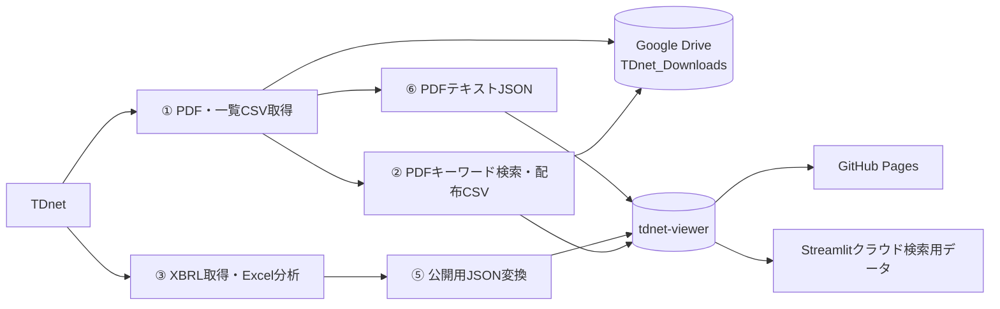

# tdnet_get

TDnetから適時開示資料（PDF・XBRL）を取得し、キーワード検索用データと財務分析データを生成・公開するシステムです。

現在の日次処理はGitHub Actions上で動作するため、PCの電源が切れていても実行されます。取得したPDF・CSVは個人のGoogle Driveへ保存し、XBRL分析結果は別リポジトリのGitHub Pagesで公開します。

## 公開先・管理画面

- XBRL Financial Viewer: https://onokazu777.github.io/tdnet-viewer/
- 更新処理（GitHub Actions）: https://github.com/onokazu777/tdnet_get/actions
- 公開データのリポジトリ: https://github.com/onokazu777/tdnet-viewer
- PDFキーワード検索（Streamlit）: 公開URLはこのリポジトリ内に未記録
- ローカルキーワード検索: http://localhost:8501

## 処理の概要



平日の17:05、20:05、23:55（JST）にGitHub Actionsが起動します。手動実行では、単日・月・日付範囲を指定できます。

## 主な構成

- `.github/workflows/daily_update.yml`  
  PC不要の日次処理。PDF・CSVのGoogle Drive保存と`tdnet-viewer`の更新まで行います。
- `.github/workflows/keepalive.yml`  
  GitHubの「公開リポジトリが60日間無活動だとscheduleを停止する」仕様を回避するため、月1回空コミットを作成します。
- `①_...py` ～ `⑥_...py`  
  取得、検索、XBRL分析、表示、JSON変換、PDFテキスト抽出を担当します。
- `keyword_search_app.py`  
  ローカルPDF・ローカルJSON・GitHub Pages上のJSONを検索するStreamlitアプリです。
- `run_auto_local.py` / `auto_local.bat`  
  PC上でPDF・CSVをGoogle Driveへ保存する旧ローカル経路です。GitHub Pagesの更新は行いません。

## 詳細ドキュメント

- [システム構成](docs/system-architecture.md)
- [データフローとファイル一覧](docs/data-flow.md)
- [プログラム一覧](docs/programs.md)
- [運用・障害対応](docs/operations.md)

## ローカル環境

```powershell
pip install -r requirements.txt
```

キーワード検索アプリ:

```powershell
.\start_streamlit_local.bat
```

XBRL Viewer:

```powershell
$env:XBRL_DATA_ROOT = "$HOME\Desktop\XBRL_Data"
python -m streamlit run "④_xbrl_viewer.py"
```

## 機密情報

以下はGitHub ActionsのRepository secretsで管理し、READMEやコードへ値を書かないでください。

- `VIEWER_PAT`: `tdnet-viewer`へpushするためのGitHubトークン
- `RCLONE_CONFIG`: 個人Google Driveへ接続するrclone設定

Streamlitの管理者パスワードを使う場合は、Streamlit secretsの`admin_password`で管理します。
