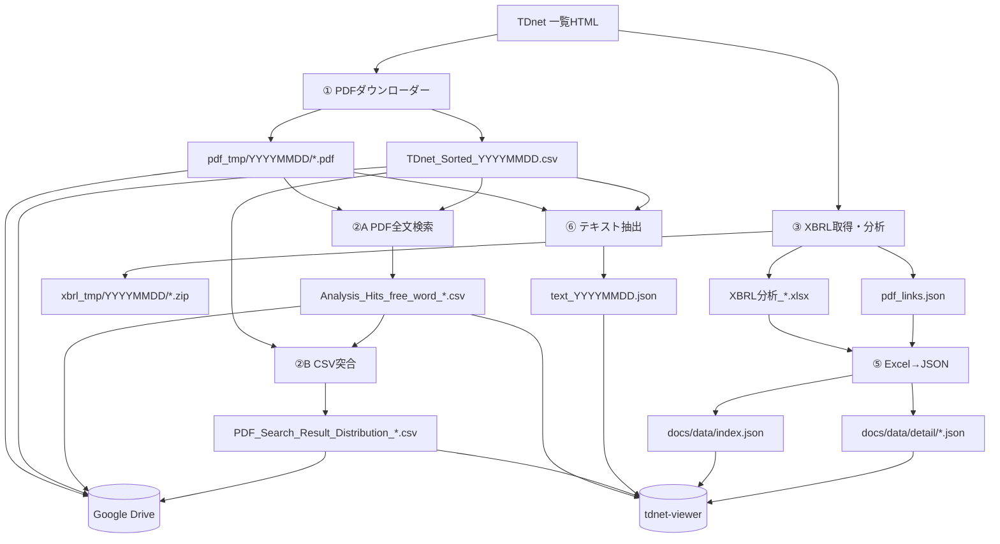

# データフローとファイル一覧

## 起動（いつ動くか）

現行本番では、外部cronがGitHub Actionsを起動します。処理の中身はこの文書のとおりです。

```text
外部cron → workflow_dispatch(slot) → Daily XBRL Update → 下記のデータフロー
```

起動仕様の詳細は [on-time-trigger.md](on-time-trigger.md) と [operations.md](operations.md) を参照してください。

## 日次処理の流れ



## ファイル別の役割

### ① TDnet PDF取得

入力:

- TDnet一覧ページ  
  `https://www.release.tdnet.info/inbs/I_list_{ページ}_{YYYYMMDD}.html`
- 対象指定  
  `YYYYMMDD`、`YYYYMM`、または`YYYYMMDD YYYYMMDD`

一時・中間出力:

```text
<save-root>/
├─ YYYYMMDD/
│  ├─ <コード>_<時刻>_<会社名>_<表題>.pdf
│  └─ TDnet_Sorted_YYYYMMDD.csv
└─ TDnet_Sorted_YYYYMMDD.csv
```

`TDnet_Sorted`には会社コード、会社名、表題、TDnet URL、PDFファイル名など、後続処理で使うメタデータが入ります。日別フォルダとルート直下の両方へ保存します。

### ②A PDF全文キーワード検索

入力:

- `<save-root>/YYYYMMDD/*.pdf`
- `TDnet_Sorted_YYYYMMDD.csv`
- コマンド引数の検索キーワード

出力:

```text
<save-root>/Analysis_Hits_free_word_<対象ラベル>.csv
```

対象ラベルの例:

- 単日: `20260717`
- 月: `202607`
- 範囲: `20260714_20260717`

各PDFについて、キーワードが見つかったページ番号を記録します。同名の既存結果は`archive/`へ移動してから再生成します。

### ②B 配布用CSV

入力:

- `TDnet_Sorted_YYYYMMDD.csv`
- `Analysis_Hits_free_word_<対象ラベル>.csv`

出力:

```text
<save-root>/PDF_Search_Result_Distribution_free_word_<対象ラベル>_sh.csv
```

TDnetリンクとローカルPDFリンクを含む配布用CSVです。Actionsではメタデータ不足があっても処理継続する設定です。

### ② title 表題検索

入力:

- `TDnet_Sorted_YYYYMMDD.csv`
- 表題検索キーワード

出力:

```text
<save-root>/Title_Hits_free_word_<対象ラベル>.csv
```

PDF本文を開かず、一覧CSVの表題だけを高速検索します。現在の日次Actionsでは実行していません。

### ③ XBRL取得・財務分析

入力:

- TDnet一覧ページ
- TDnet上のXBRL ZIP
- `xbrl_taxonomy.py`の要素名・日本語ラベル対応表

中間・最終出力:

```text
<xbrl-root>/
└─ YYYYMMDD/
   ├─ <XBRL ZIPファイル>.zip
   ├─ XBRL分析_<コード>_<会社名>.xlsx
   └─ pdf_links.json
```

Excelには会社情報、財務データ、前期比、大幅変動科目、利益率等を出力します。`pdf_links.json`は会社コードとTDnet PDF URLの対応表で、⑤が公開用JSONへURLを引き継ぐために使います。

保存ルート:

- Actions: `./xbrl_tmp`
- スクリプトのローカル既定値: `G:\マイドライブ\TDnet_XBRL`
- ④・⑤のローカル既定値: `%USERPROFILE%\Desktop\XBRL_Data`

ローカルで③→④/⑤を連携するときは、保存先または`XBRL_DATA_ROOT`を合わせる必要があります。

### ⑤ XBRL Excelから公開JSON

入力:

- `XBRL_DATA_ROOT/YYYYMMDD/XBRL分析_*.xlsx`
- `XBRL_DATA_ROOT/YYYYMMDD/pdf_links.json`
- Yahoo Financeの株価指標
- `docs/data/stock_cache.json`

出力:

```text
docs/data/
├─ index.json
├─ stock_cache.json
└─ detail/
   └─ YYYYMMDD_<コード>.json
```

- `index.json`: 日付、コード、会社名、表題、増収率、営業利益率、PBR、予想PER、配当利回り等
- `detail/*.json`: Excelの各シートをJSON化した詳細データ
- `stock_cache.json`: yfinanceから取得した株価指標のキャッシュ

Actionsでは生成後、既存の`tdnet-viewer/data/index.json`へ詳細ファイル名単位でマージします。

### ⑥ PDFテキスト抽出

入力:

- `<save-root>/YYYYMMDD/*.pdf`
- `TDnet_Sorted_YYYYMMDD.csv`

出力:

```text
<out-dir>/text_YYYYMMDD.json
```

JSONには日付、抽出時刻、PDF件数と、PDFごとの会社コード・会社名・分類・TDnet URL・ページ別本文を保存します。

Actionsでの保存先:

```text
text_data/text_YYYYMMDD.json
  → tdnet-viewer/data/text/text_YYYYMMDD.json
```

`tdnet-viewer/data/text/index.json`には利用可能な日付一覧を保存します。テキストJSONは180日保持し、それより古いものを削除します。

## 永続保存先

### Google Drive

Actionsの`./pdf_tmp`を`gdrive:TDnet_Downloads`へ`rclone copy`します。

保存対象:

- 全PDF
- 日別およびルートの`TDnet_Sorted` CSV
- キーワード検索結果CSV
- 配布用CSV

`copy`なので、コピー元にない過去ファイルをGoogle Driveから削除しません。

### `tdnet-viewer`

```text
data/
├─ index.json                   XBRL一覧
├─ detail/*.json               XBRL詳細
├─ search/*.csv                ②の検索・配布結果
└─ text/
   ├─ index.json               利用可能日付
   └─ text_YYYYMMDD.json       ページ別PDF本文
```

### Actions実行環境だけに存在するファイル

次は実行終了時に消えます。

- `pdf_tmp`
- `xbrl_tmp`
- `text_data`
- cloneした`viewer`ディレクトリ

必要な成果物は、終了前にGoogle Driveまたは`tdnet-viewer`へコピーされます。

## 表示アプリが読むファイル

| アプリ・モード | 主な入力 |
|---|---|
| XBRL GitHub Pages Viewer | `tdnet-viewer/data/index.json`、`data/detail/*.json` |
| `④_xbrl_viewer.py` | `XBRL_DATA_ROOT/YYYYMMDD/XBRL分析_*.xlsx` |
| キーワード検索・ローカルPDF | `G:\マイドライブ\TDnet_Downloads/YYYYMMDD/*.pdf`と一覧CSV |
| キーワード検索・ローカルJSON | `text_data/text_YYYYMMDD.json`とGoogle Drive上のPDF |
| キーワード検索・クラウド | GitHub Pagesの`data/text/index.json`と`text_YYYYMMDD.json` |

## 注意事項

- TDnetのPDF URLは公開から約30日で無効になる場合があります。長期閲覧にはGoogle Drive上のPDFを使います。
- ActionsのDriveアップロードは`continue-on-error`です。Drive認証が失敗しても、XBRL公開処理は継続します。
- ③のローカル既定保存先と④・⑤のローカル既定参照先は異なるため、環境変数で明示するのが安全です。
