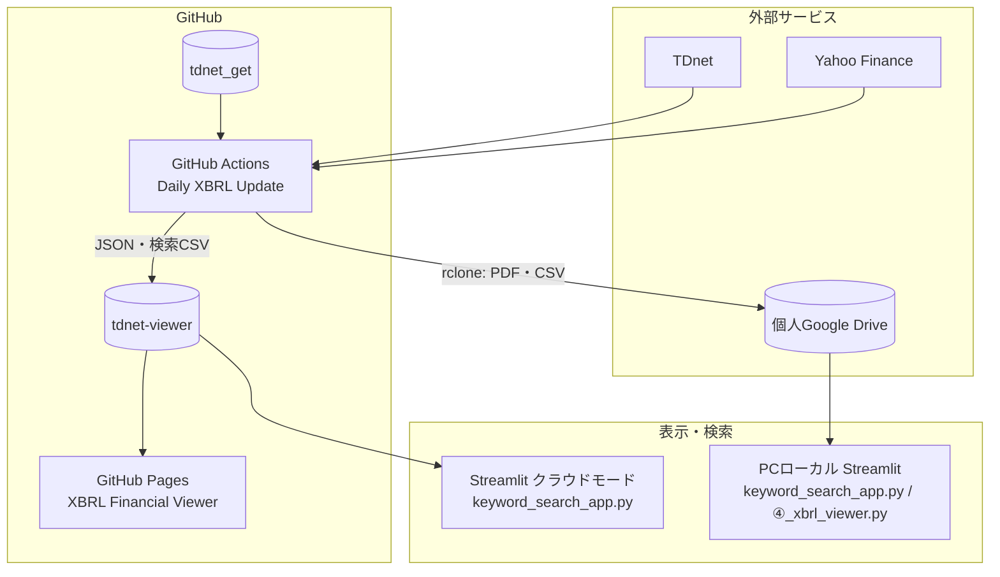

# システム構成

## 目的

TDnetの適時開示資料を自動取得し、次の2系統で利用できるようにします。

1. PDF・CSVを個人のGoogle Driveへ蓄積する
2. XBRL財務分析とPDF全文検索用データをWebで参照できる形にする

## 全体構成



## コンポーネント

### 1. `tdnet_get`リポジトリ

取得・解析プログラムとGitHub Actionsの定義を管理します。日次処理の実行主体はこのリポジトリです。

- リポジトリ: `onokazu777/tdnet_get`
- ワークフロー: `.github/workflows/daily_update.yml`
- 定期実行: 平日5分おき起動＋枠判定（11:35 / 15:35 / 17:05 / 20:05 / 23:55 JST）
- 完了メール: 11:35 / 15:35（および手動実行）のみ
- 備考: GitHub単発cronの長時間遅延対策として枠判定方式を採用
- 手動実行: Actions画面の`Run workflow`

### 2. GitHub Actions

Ubuntu上の一時的な実行環境で、次の処理を行います。

1. Python 3.11と依存ライブラリを準備
2. TDnetからPDFと一覧CSVを取得
3. PDF全文キーワード検索と配布CSVを作成
4. PDFテキストを日別JSONへ変換
5. TDnetからXBRL ZIPを取得してExcel分析
6. ExcelをGitHub Pages用JSONへ変換
7. PDF・CSVをrcloneで個人Google Driveへコピー
8. JSON・検索CSVを`tdnet-viewer`へpush

Actionsの作業ディレクトリは実行終了時に破棄されます。永続保存が必要なファイルはGoogle Driveまたは`tdnet-viewer`へ送ります。

### 3. 個人Google Drive

- Actions上の名前: `gdrive:TDnet_Downloads`
- PC上の見え方: `G:\マイドライブ\TDnet_Downloads`
- 主な保存物:
  - 日付フォルダ内の全PDF
  - `TDnet_Sorted_YYYYMMDD.csv`
  - キーワード検索結果CSV
  - 配布用CSV

認証設定はGitHub Secretの`RCLONE_CONFIG`に保存します。設定値そのものは機密情報です。

### 4. `tdnet-viewer`リポジトリ

Web公開する静的ファイルを保持する別リポジトリです。

- 一覧: `data/index.json`
- XBRL詳細: `data/detail/*.json`
- 検索結果CSV: `data/search/*.csv`
- PDFテキスト: `data/text/text_YYYYMMDD.json`
- テキスト日付一覧: `data/text/index.json`

GitHub Actionsは`VIEWER_PAT`を使ってこのリポジトリへpushします。

### 5. GitHub Pages

- URL: https://onokazu777.github.io/tdnet-viewer/
- `tdnet-viewer`内の静的HTML・JSONを配信
- XBRL Financial Viewerの画面と、Streamlitクラウドモードが参照するJSONの配信元

### 6. Streamlitアプリ

#### `keyword_search_app.py`

3種類のデータソースに対応します。

- ローカルPDF: Google Drive上のPDFを毎回直接検索
- ローカルJSON: `⑥_pdf_text_extractor.py`で作成したJSONを高速検索
- クラウド: GitHub Pagesの`data/text`を検索

環境変数`TDNET_DEPLOY_MODE=cloud`ならクラウド専用UI、それ以外はローカル用UIになります。

#### `④_xbrl_viewer.py`

ローカルのXBRL分析Excelを表示するStreamlitアプリです。データ場所は`XBRL_DATA_ROOT`で指定します。GitHub Pages版の画面とは別実装です。

## 実行経路

### 現在の本番経路（PC不要）

```text
GitHub schedule
  → daily_update.yml
  → TDnet取得・解析
  → Google Drive保存
  → tdnet-viewerへpush
  → GitHub Pages反映
```

### ローカル経路（任意・予備）

```text
Windowsタスクスケジューラ
  → auto_local.bat
  → run_auto_local.py
  → ① PDF取得
  → ② キーワード検索・配布CSV
  → G:\マイドライブ\TDnet_Downloads
```

ローカル経路はXBRL解析、公開JSON作成、`tdnet-viewer`更新を行いません。本番経路が正常なら`TDnet_Daily_Auto_Local`は無効のままで問題ありません。

## 設定値

### GitHub Secrets

| 名前 | 用途 |
|---|---|
| `VIEWER_PAT` | `tdnet-viewer`のclone・push |
| `RCLONE_CONFIG` | 個人Google Driveへのrclone認証 |
| `MAIL_SMTP_SERVER` | 完了メールのSMTPサーバ |
| `MAIL_SMTP_PORT` | 完了メールのSMTPポート |
| `MAIL_USERNAME` | 完了メールのSMTPユーザー |
| `MAIL_PASSWORD` | 完了メールのSMTPパスワード |
| `GITHUB_TOKEN` | keepaliveの空コミット（GitHubが自動発行） |

### 環境変数

| 名前 | 用途 | 主な値 |
|---|---|---|
| `XBRL_DATA_ROOT` | ④・⑤が参照するXBRL分析データのルート | Actions: `./xbrl_tmp`、ローカル: `Desktop\XBRL_Data`等 |
| `TDNET_DEPLOY_MODE` | キーワード検索アプリの表示モード | `cloud`または`local` |
| `PYTHONIOENCODING` | 日本語ログの文字コード | `utf-8` |

### Streamlit Secrets

| 名前 | 用途 |
|---|---|
| `admin_password` | `④_xbrl_viewer.py`の管理者ログイン・Excelダウンロード許可 |

## 外部依存

- TDnet: 一覧HTML、PDF、XBRL ZIP
- Yahoo Finance / yfinance: PBR、予想PER、配当利回り、株価騰落率、時価総額
- GitHub Actions: 定期実行
- GitHub Pages: 静的Web公開
- Google Drive: PDF・CSVの長期保存
- Streamlit: ローカルまたはクラウドの検索・閲覧UI

## 継続運用対策

公開リポジトリでは60日間活動がないとscheduled workflowが自動停止します。`.github/workflows/keepalive.yml`が毎月1日に空コミットを作成し、この停止を防ぎます。
